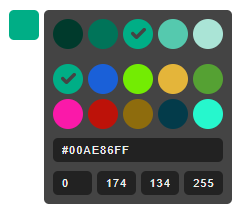
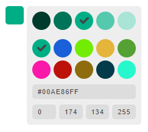
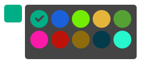

# Super Coolor Picker
Custom color picker with HTML custom elements (Web components).


## Install
Install via **npm** or download **js** file
```bash
$ npm install super-coolor-picker
```
```html
<html>
    <body>
        ...
        <script src="https://unpkg.com/super-coolor-picker@1.0.0/dist/super-coolor-picker.js"></script>
    </body>
</html>
```


## Usage

```html
<form name="style">
    <super-coolor-picker 
        value="#00b2a9ff"
        name="color"
        colors="#F1E3F3FF;#C2BBF0FF;#8FB8EDFF;#62BFEDFF"
        lite="false"
        theme="dark"
        shades="2"
        width="30px"
        height="30px"
    ></super-coolor-picker>
</form>
```


## Features

* Color mixing (hold *Alt* and click on a color to mix it with the current color)
* User defined colors
* Lite mode
* Light/Dark theme
* User definded number of shades generated for each color selected
* Insert new colors in HEX or RGBA format


## Screenshots

#### Dark Theme


#### Light Theme


#### Lite Mode



## License

**Super Cooler Picker** is freely distributable under the terms of the [MIT License](https://github.com/moment/moment/blob/develop/LICENSE).